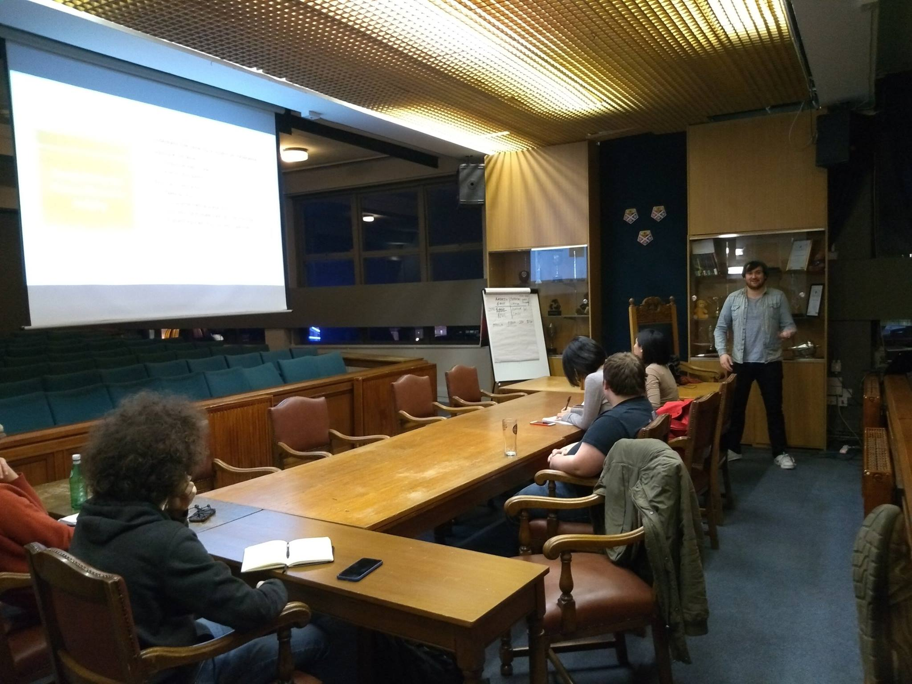

&nbsp;
&nbsp;

# Debating

&nbsp;

During my time at Strathclyde I became an active member of the Debates Society, and served as Social's Convenor during my final year. As well as being a lot of fun, debating also helped me to improve my critical thinking, public speaking and being able to articulate my thoughts.

&nbsp;
&nbsp;

&nbsp;
&nbsp;

# Music

&nbsp;

I have also had a passion for music throughout my life, including reaching Grade 6 Violin in secondary school. I love attending gigs and have more recently became interested in playing guitar.

&nbsp;
&nbsp;
