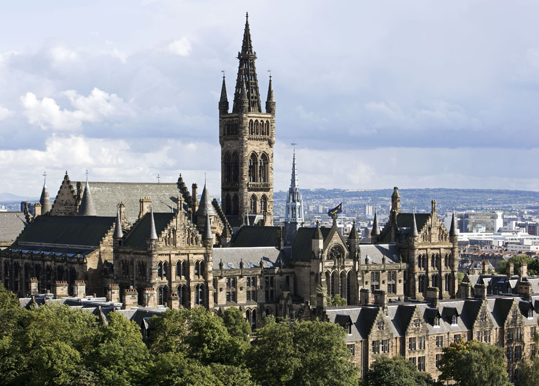
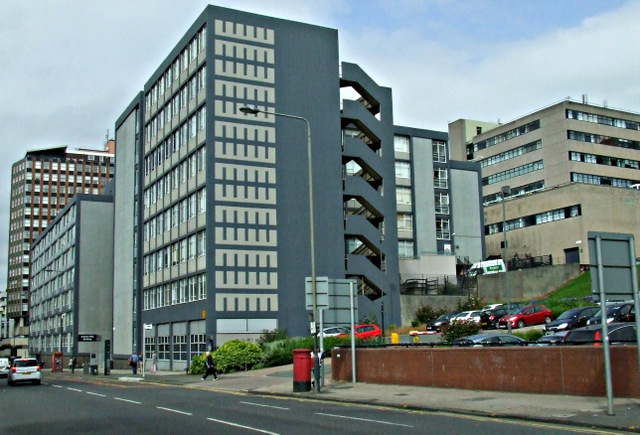

# University of Glasgow
## MSc Research Methods in Psychological Science
### September 2018 - present

I'm currently studying for a Masters degree, Research Methods in Psychological Science. This has allowed me to develop more practical skills relating to the research process in addition to the theoretical knowledge I gained during my undergraduate degree. It is hugely beneficial to work with such distinguished researchers within their respective fields of Psychology. The course includes a range of modules, including:

* Professional Skills
* Data Skills for Reproducible Science
* Qualitative Methods
* Sleep and Circadian Timing
* Introduction to Matlab
* Advanced Statistics
* Research Methods in Cognitive Science
* Research Project
        
The title of my thesis is "Situated predictors of hair-pulling", supervised by Dr Lawrence Barsalou, and you can read more about this research project [here](researchexperience.html).

# University of Strathclyde
## BA (Hons) Psychology
### 2014-2018

I completed my undergraduate degree in Psychology at University of Strathclyde, and graduated in June 2018 with a first class degree. I was lucky to receive excellent teaching at Strathclyde, across a range of different topics within Psychology. During my honours year, I studied modules such as:

* The Psychology of Mental Health
* Belief and Anomalistic Experience
* Health Psychology
* Neuropsychology of Ageing and Dementia
* The Psychology and Cognitive Neuroscience of Face Recognition
* Critical Review (The Relationship Between Child Abuse and Dissociation)
* Dissertation
        
The title of my dissertation was "The role of theory of planned behaviour in Type D personality and alcohol use", and it was supervised by Dr Lynn Williams. More information on this research project can be found on the  [Research Experience](researchexperience) page.