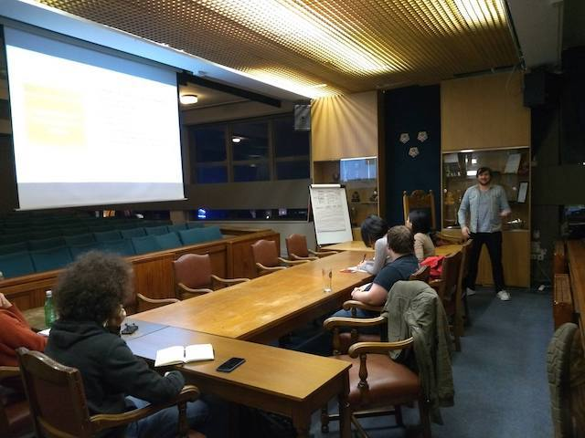
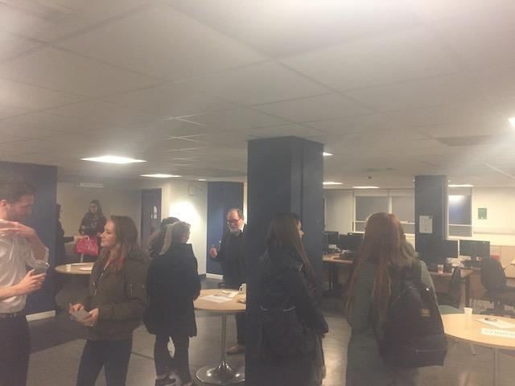
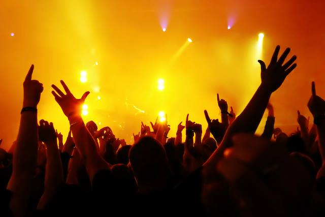

&nbsp;
&nbsp;

# Debating

&nbsp;

During my time at Strathclyde I became an active member of the Debates Society, and served as Social's Convenor during my final year. As well as being a lot of fun, debating also helped me to improve my critical thinking, public speaking and being able to articulate my thoughts. I also attended national competitions including Bogwall 2016 at University of St Andrews and the 2017 Glasgow University Pro-Am.

&nbsp;
&nbsp;

&nbsp;
&nbsp;
&nbsp;

# Psychology Society

&nbsp;

During my final year of undergraduate, I was elected to the position of President of the Psychology Society. As well as organising eight different social events across the course of the academic year, myself and the Vice President organised and co-hosted the first Psychology Society Careers Event, in which we recruited speakers from the areas of Clinical, Educational, Occupational and Forensic and introduced them at the event.

&nbsp;

I also oversaw the creation of the Grad Ball Sub Committee, and acted as a committee member in organising this large-scale event. In addition to these activities, I organised an educational documentary night which explored the themes of autism and obsessive compulsive disorder.

&nbsp;
&nbsp;

&nbsp;
&nbsp;
&nbsp;

# Music

&nbsp;

I have also had a passion for music throughout my life, including reaching Grade 6 Violin in secondary school. I love attending gigs and have more recently became interested in playing guitar.

&nbsp;
&nbsp;

&nbsp;
&nbsp;
&nbsp;
