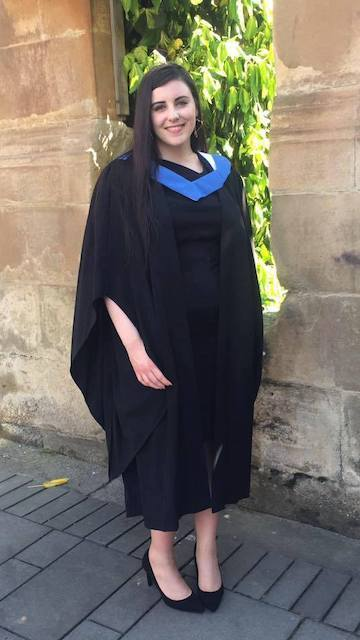

&nbsp;
&nbsp;
&nbsp;
&nbsp;
&nbsp;
&nbsp;

My name is Katie Hendry and I'm a postgraduate student in the University of Glasgow's [Institute of Neuroscience and Psychology](http://www.gla.ac.uk/researchinstitutes/neurosciencepsychology/).

&nbsp;
&nbsp;

&nbsp;
&nbsp;

I'm currently working towards an MSc in Research Methods of Psychology. My MSc thesis is being supervised by [Dr Lawrence Barsalou](http://barsaloulab.org/lab-members/lawrence-barsalou/) and we are investigating [situated predictors of hair-pulling](researchexperience.html). Upon completion of my masters, I hope to pursue a career in clinical practice, ultimately gaining entry to the DClinPsych Clinical Psychology at the University of Glasgow.

&nbsp;
&nbsp;

Here on my webpage you can read about my [Education](education.html), [Research Interests](researchinterests.html) and [Research Experience](researchexperience.html). A copy of my CV can be found [here](Cirriculum Vitae Final PDF.pdf).

&nbsp;

My [contact details](contactdetails.html) are also listed if you wish to contact me.

&nbsp;
&nbsp;
