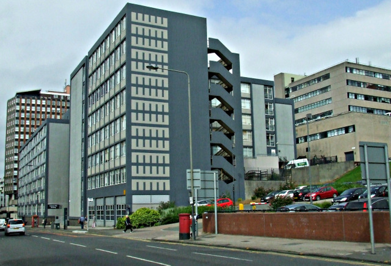

&nbsp;
&nbsp;

## University of Glasgow

&nbsp;

Currently, I am working on a project supervised by [Dr Lawrence Barsalou](http://barsaloulab.org/lab-members/lawrence-barsalou/), which expands on the research conducted by Courtney Taylor-Browne on trichotillomania (hair-pulling disorder). The first part of Courtney's study investigated the conditions under which individuals with trichotillomania often tend to pull their hair, and this established a set of situations in which hair pulling generally occurs. The second part of the study investigated factors, such as internal and external cues, and how much they predicted both frequency and urge of hair pulling across this range of situations. The current study we are working on aims to replicate this previous work, with the aim of collapsing variables which were highly correlated in the previous study. Trichotillomania has not been the subject of a huge amount of research, and we are hoping we will provide some valuable insights into this area.

&nbsp;
&nbsp;
&nbsp;

## University of Strathclyde

&nbsp;
&nbsp;

&nbsp;
&nbsp;

During my final year, I worked with [Dr Lynn Williams](https://www.strath.ac.uk/staff/williamslynndr/) on a study which looked at the role of Theory of Planned Behavour in the relationship between alcohol use and Type D personality. Type D personality is the synergistic effect of negative affectivity and social inhibition, an area Lynn has done a lot of research into. Although we found non-significant relationships between alcohol use and both Type D/Theory of Planned Behaviour, we did find some interesting relationships between Type D and some TPB variables.

The full paper can be downloaded [here](DissertationTypeDFinal.docx).

&nbsp;
&nbsp;
&nbsp;

## Humboldt-Universität zu Berlin

&nbsp;
&nbsp;

&nbsp;
&nbsp;

I was honoured to be selected for a competitive ERASMUS research placement during the summer between my third and fourth year. I interned as a research assistant in the departments of Clinical, Cognitive and Biological Psychology at Humboldt University in Berlin.

My duties in the Clinical department involved standardising test scores for anxiety and depression, using QRSTool to carry out analysis on heart rates of participants, conducting analyses using BrainVision Analyser 2.1 including the removal of artefacts, and writing up an article for a study which looked at training participants with OCD to respond positively to errors. I worked under the supervision of [Professor Julia Klawohn](https://www.researchgate.net/profile/Julia_Klawohn), who now works at Florida State University.

I also helped the Cognitive and Biological departments to run participants on the EEG. The cognitive department conducted a fascinating study on the cumulative semantic interference effect which was later published: you can read the full paper [here](https://www.sciencedirect.com/science/article/pii/S0010027717301415).

&nbsp;
&nbsp;